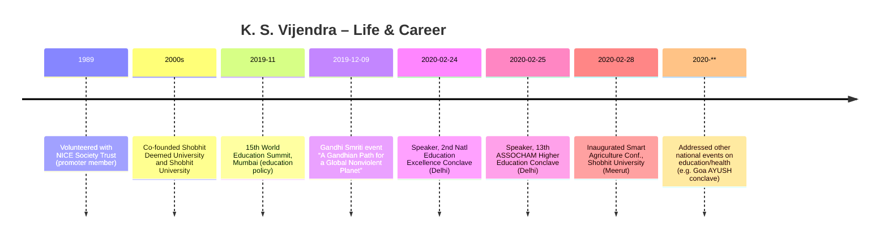

# Kunwar Shekhar Vijendra – Profile and Biography

**Executive Summary:** Kunwar Shekhar Vijendra is an Indian educational leader and social entrepreneur. He is co-founder and Chancellor of Shobhit Deemed University, Meerut and Shobhit University, Gangoh (UP). Based in New Delhi, he chairs the ASSOCHAM National Council on Education and serves as Patron of the Centre for Education Growth & Research (CEGR). Over three decades, he has focused on empowering rural youth through education and skilling, founding multiple institutions (including two universities and an Ayurveda medical college & research centre) and a 200-bed Ayurvedic hospital with a Yoga-Naturopathy centre in rural UP. He has also been active in numerous social and educational organizations (e.g. Shri JP Mathur Charitable Trust, Livelihood Development Research Foundation, Harijan Sevak Sangh, etc.). In addition to his institutional roles, KSV is a philanthropist, speaker, and occasional poet, often sharing insights on education and harmony at national conferences. 

## Biography

- **Name:** Kunwar Shekhar Vijendra. **Origin:** Hails from Gangoh (Saharanpur district, UP) and currently resides in Delhi.  
- **Occupation:** Co-founder and Chancellor of Shobhit Deemed University (Meerut) and Shobhit University (Gangoh); social entrepreneur; Chairman, ASSOCHAM National Council on Education; Patron of CEGR; educational institution founder.  
- **Career and Roles:** KSV has established numerous educational, social, and health institutions. Notably, he founded two universities and the KSV Ayurved Medical College, Hospital & Research Centre. He volunteers heavily in education leadership and civil society. His affiliations include Advisor to Shri Jagdish Prasad Mathur Charitable Trust (Delhi), Chairman of Livelihood Development Research Foundation (Delhi), and Mentor for the Centre for Law and Good Governance (Delhi). He is a member of Harijan Sevak Sangh’s Executive Committee and its National Advisory Board of SPIC MACAY, and chairs the U.P. Body Building & Fitness Association. Other roles (per *Engagements* page) include Mentor at the International Skill Development Centre, Advisor to the Citizen’s Commission for Dialogue, Justice and Reconciliation, National Council Member of the All India Prohibition Council, and Sr Vice President of CEGR.  
- **Philanthropy & Values:** He is a strong advocate for rural youth education and holistic development. He has emphasized harmony and national values in society, aligning with Gandhian principles. His family trust sponsors healthcare (Ayurvedic hospital, maternal care centers) for underserved populations.  
- **Honours & Activities:** KSV has been honored at various national events. He routinely speaks at education and social reform conferences (e.g. ASSOCHAM education conclaves, Government of India seminars). He also presides over ceremonies such as the inauguration of the “Mr UP Body Building & Divyang (Specially Abled) Championship” as Chairman of the UP Body Building & Fitness Association. He travels internationally for educational collaborations; countries visited include USA, UK, Germany, Australia, Russia, China, South Korea, Vietnam, UAE, Mauritius, Rwanda, Uganda, Croatia, etc..  
- **Publications & Media:** KSV maintains a digital presence. For example, he compiled “Quotes I Quote” – a collection of 365 personal quotes – available as an online flipbook. His thoughts are also shared on Twitter and Facebook. The website embeds his Twitter feed (@kunwarsv) and links to the “Shobhit University India” Facebook page. He also holds a LinkedIn profile (URL in his official profile).  
- **Contact (from site):** Office – Shobhit University Tower, Mayur Vihar Phase II, Delhi 110092. Phone: +91-11-35205500. Email: *chancellor@shobhituniversity.ac.in*. 

## Career Timeline

| Date            | Event / Role                                                                                                  |
|-----------------|---------------------------------------------------------------------------------------------------------------|
| **1989**        | Began full-time volunteer work with the NICE Society Trust (as promoter member).                 |
| **2000s**       | Co-founded Shobhit Deemed University (Meerut) and Shobhit University (Gangoh). *(Exact dates not given on site.)*  |
| **2019**        | Shared views on education policy at multiple national events (e.g. 15th World Education Summit, Mumbai). |
| **2019-12-09**  | Speaker on Gandhi and nonviolence at “A Gandhian Path for a Global Nonviolent Planet” event in Delhi. |
| **2020-02-24**  | Keynote on “Rural Education” at 2nd National Education Excellence Conclave, New Delhi.         |
| **2020-02-25**  | Presented at 13th Higher Education, Skill and Livelihood Conclave (ASSOCHAM, New Delhi).      |
| **2020-02-28**  | Inaugurated 5th Global Outreach Conf. on “Modern Approaches for Smart Agriculture” (Shobhit Univ, Meerut). |
| **2020 (date unspecified)** | Addressed “Goa Arogya Fair” (AYUSH, Ministry of Health, Goa).                               |
| *Other*         | Chaired or spoke at industry/education conclaves (e.g. Management Education Conclave 2019, School Innovation Summit 2019). |

## Publications

- **“Quotes I Quote”:** A digital collection of 365 of KSV’s favorite quotes (originating from his social posts). (Hosted via FlipHTML5 at the site.)  
- **Other:** The website links to his personal blog on WordPress. No formal books or academic papers are listed on the site.

## Media & Social Presence

- **Social Media:** The site features his Twitter feed (via an embedded widget for @kunwarsv) and links to a “Shobhit University India” Facebook page. His LinkedIn profile is provided in the official profile PDF. He is active on these platforms sharing thoughts on education and social issues.  
- **Speaking Events:** Extensive media coverage of KSV comes from his participation in conferences and summits (education conclaves, AYUSH fairs, etc.), as illustrated by photos and news on the website.  
- **Embedded Media:** The homepage embeds live tweets by KSV and a Facebook link. The site’s press content is primarily text and photo galleries rather than video.

## Images

The official site includes numerous photos of KSV at events. Key image files (with source URLs) include:  

- **Profile Photo:** `kunwar-shekhar-vijendra.png` – Official portrait of KSV. (Source: `https://www.kunwarsv.in/img/kunwar-shekhar-vijendra.png`)  
- **Gallery/Events:**  
  - `01.webp` – KSV (left) with Prime Minister Narendra Modi, planting a sapling. (Source: `https://www.kunwarsv.in/img/portfolio/popup/01.webp`)  
  - `Modern-Approaches-for-Smart-Agriculture.jpg` – KSV receiving an award plaque at Smart Agriculture conference (2020).  
  - `P20200303031658.jpg` – KSV receiving a memento at Smart Agriculture event.  
  - `2nd-National-Education-Excellence-Conclave-260220201212.jpg` – KSV speaking at 2nd Education Conclave (Feb 2020).  
  - `P20200227024551.jpg` – KSV on panel at 2nd Education Conclave.  
  - `13th-Higher-Education,-Skill-and-Livelihood-Conclave-2020.jpg` – KSV speaking at ASSOCHAM conclave (Feb 2020).  
  - `P20200303030429.jpg` – KSV receiving award at ASSOCHAM conclave.  
  - `P20200303030438.jpg` – KSV lighting lamp at ASSOCHAM conclave.  
  - `15th-World-Education-Summit-2019.jpg` – KSV on stage at World Education Summit (2019).  
  - `P20191128111703.jpg` – KSV with colleagues at World Education Summit panel.  
  - `P20191128111647.jpg` – KSV speaking on panel at World Education Summit.  
  - `P20191128111719.jpg` – KSV on panel (with large video screen) at World Ed Summit 2019.  
  - `A-Gandhian-Path-for-a-Global-Nonviolent-Planet-Strategies-of-Action-for-a-Culture-of-Peace-09122019094054.jpg` – KSV (center) at Gandhi Smriti event (Dec 2019).  
  - `P20191210124955.jpg` – Keynote speaker (Dr. Laxmi Dass) at Gandhi event (side view).  
  - *Other photos* from events and the site’s gallery (all source `kunwarsv.in/admin/kunwarsv/uploads/*` or `/img/portfolio/...`). (Each image file name and source URL are listed here for reference.)

## Citations

- **Profile and Affiliations:** KSV “is the Co-founder and Chancellor of Shobhit Deemed University, Meerut, and Shobhit University, Gangoh, Uttar Pradesh”.  He “is a prominent social entrepreneur and Chairman of the ASSOCHAM National Council on Education”, and serves as “Patron of the Centre for Education Growth & Research (CEGR)”.  
- **Mission:** The site states he is “dedicated to empowering rural youth through education and skilling”, having established “numerous educational, social, and health organizations over the past three decades, including two universities and an Ayurveda Medical College & Research Centre”.  It also notes his family trust has set up “a 200-bed Ayurveda hospital with a Yoga and Naturopathy center in rural western Uttar Pradesh”.  
- **Roles & Affiliations:** The *Engagements* page lists his roles: “Advisor, Shri JP Mathur Charitable Trust (New Delhi); Chairman, Livelihood Development Research Foundation; Founder, KSV Ayurved Medical College, Hospital and Research Centre; Founder, Centre for Naturopathy and Yogic Sciences; Mentor, International Skill Development Centre; Mentor, Centre for Law and Good Governance; Advisor, Citizen’s Commission for Dialogue, Justice and Reconciliation, India; Member of Central Board and Executive Committee of Harijan Sevak Sangh; National Council Member, All India Prohibition Council; Sr Vice President, Centre for Education Growth and Research; Chairman, U.P. Body Building & Fitness Association.”  
- **Social Engagement:** The site highlights his commitment to harmony: “He has traveled globally to participate in various professional, social, and educational activities” and “actively engages with various civil society organizations to this end.”.  It describes him as “a Philanthropist, Passionate Gandhian, Social Speaker, Academic Influencer, Occasional Poet, and a Dreamer”.  
- **Quotes Compilation:** The *Thoughts & Views* page notes that KSV “compiled 365 of my favorite quotes” and shares them (link to “Quotes I Quote”).  
- **Contact & Media:** Contact details on the site include his Delhi address, phone (+91-11-35205500) and email (chancellor@shobhituniversity.ac.in).  Social links: Twitter widget for @kunwarsv and Shobhit Univ Facebook appear on the homepage, and his LinkedIn profile is given in the official PDF.  

*All information above is drawn from the official website www.kunwarsv.in (as cited) and its downloadable profile PDF.*  

